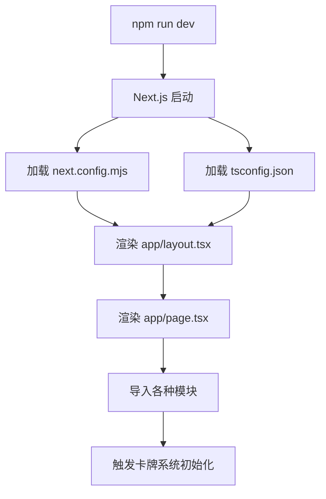

# 前端项目初始化流程详解

## 1. Next.js 应用启动流程



## 2. 模块导入与初始化的关系

### JavaScript/TypeScript 模块系统的工作原理：

```typescript
// 当你写这行代码时：
import { getStandardCardsByType } from "@/data/card";

// 实际发生的事情：
// 1. Node.js/Browser 查找 @/data/card 文件
// 2. 找到 /data/card/index.ts
// 3. **立即执行** index.ts 中的所有顶层代码
// 4. 缓存执行结果，后续导入直接返回缓存
```

### 这就是为什么 `/data/card/index.ts` 是实际的初始化入口：

```typescript
// 在 /data/card/index.ts 顶层执行的代码
console.log("这行代码在模块被首次导入时立即执行！");

// 注册转换器 - 立即执行
builtinCardManager.registerCardType("profession", {
  converter: professionCardConverter.toStandard,
});

// setTimeout - 立即执行（但回调延迟执行）
if (typeof window !== 'undefined') {
  setTimeout(async () => {
    await customCardManager.ensureInitialized();
  }, 500);
}
```

## 3. 具体的初始化触发点

在这个项目中，卡牌系统的初始化被以下文件触发：

### 主要触发点：
1. **`app/page.tsx`** (首页) - 最早的触发点
```typescript
import { getStandardCardsByType, CardType } from "@/data/card";
//                                             ↑ 触发初始化
```

2. **各种卡牌选择模态框** - 当用户打开选择框时
```typescript
// card-selection-modal.tsx
import { getStandardCardsByType, CardType } from "@/data/card";
```

3. **卡牌显示组件** - 当需要显示卡牌时
```typescript
// card-display-section.tsx  
import { ALL_STANDARD_CARDS, getCardTypeName } from "@/data/card";
```

## 4. 初始化时序问题的根源

### 问题：为什么需要 setTimeout(500ms)？

```typescript
// 问题代码在 /data/card/index.ts
setTimeout(async () => {
  await customCardManager.ensureInitialized();
}, 500);
```

**原因分析：**
1. 模块导入是**同步**的
2. 但转换器注册可能在**不同的执行上下文**中
3. 500ms 延迟是为了"等待"所有转换器注册完成
4. 这是一个**不可靠的解决方案**

### 更好的解决方案：
使用**依赖注入**和**Promise链**，而不是时间延迟：

```typescript
// 改进的方案（在refactor.md中已详细说明）
class InitializationCoordinator {
  // 当所有依赖注册完成时，自动触发初始化
  // 不依赖时间，而是依赖实际的依赖状态
}
```

## 5. 实际调试方法

### 如何查看初始化过程：

1. **打开浏览器开发者工具**
2. **查看 Console 标签**
3. **刷新页面**
4. **观察日志输出**

你会看到类似这样的输出：
```
[BUILTIN_STANDARD_CARDS] 开始转换所有内置卡牌
[Card Index] 开始延迟初始化统一卡牌系统...
[CustomCardManager] 开始初始化系统...
```

### 添加调试代码：
```typescript
// 在 /data/card/index.ts 顶部添加
console.log('=== 卡牌模块开始加载 ===');
console.log('当前时间:', new Date().toISOString());
```

## 6. 总结

**前端初始化的特点：**
1. **没有单一入口** - 通过模块导入触发
2. **延迟执行** - 很多初始化在首次使用时才发生  
3. **分散初始化** - 不同组件可能在不同时间触发相同的初始化
4. **异步复杂性** - UI渲染、数据加载、用户交互都是异步的

**在这个项目中：**
- `/data/card/index.ts` 是**实际的卡牌系统入口**
- `app/page.tsx` 是**第一个触发导入的地方**
- 初始化通过**模块导入的副作用**发生
- 500ms setTimeout 是当前的**临时解决方案**

这就是为什么我们需要重构初始化系统的原因！
